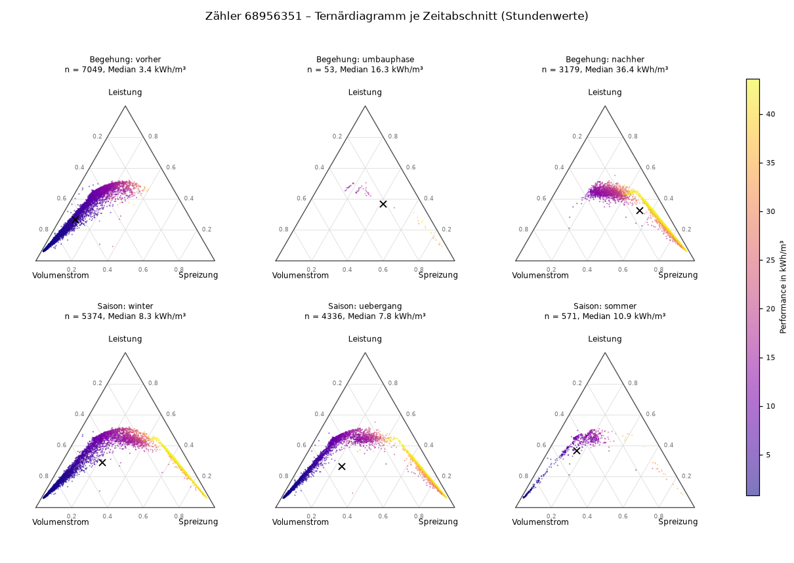
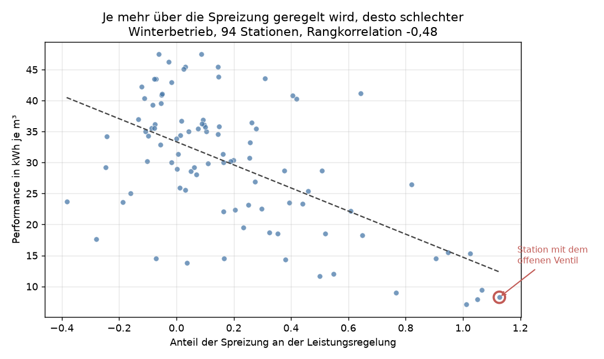
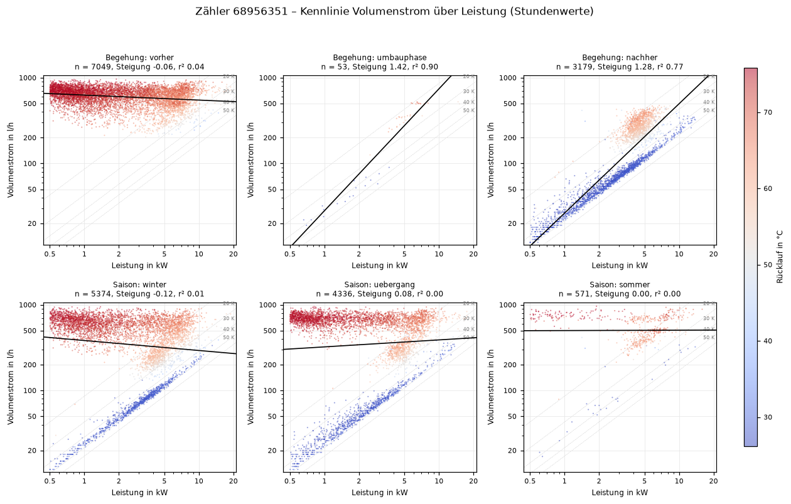
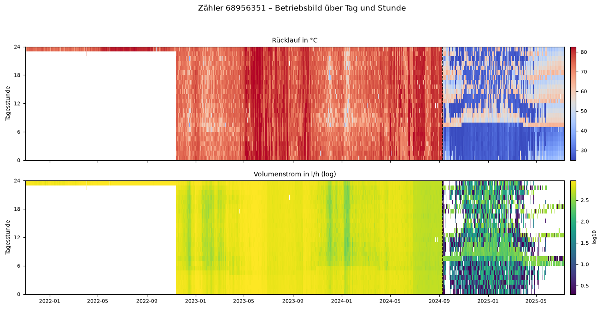
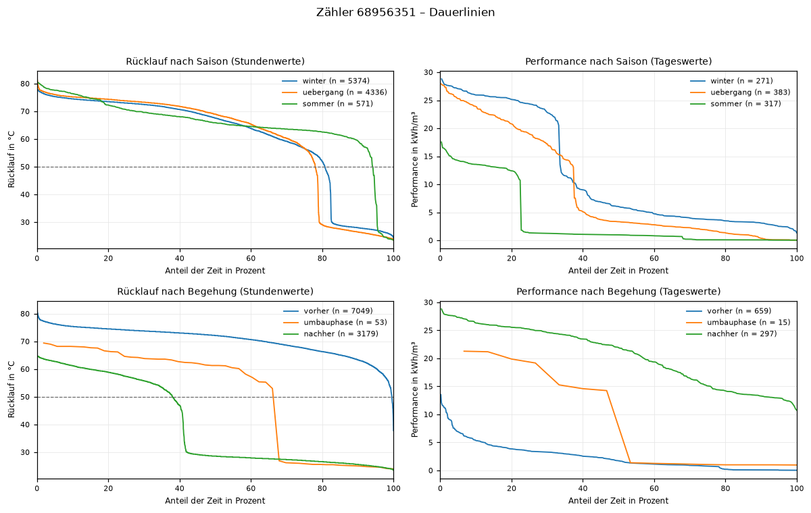
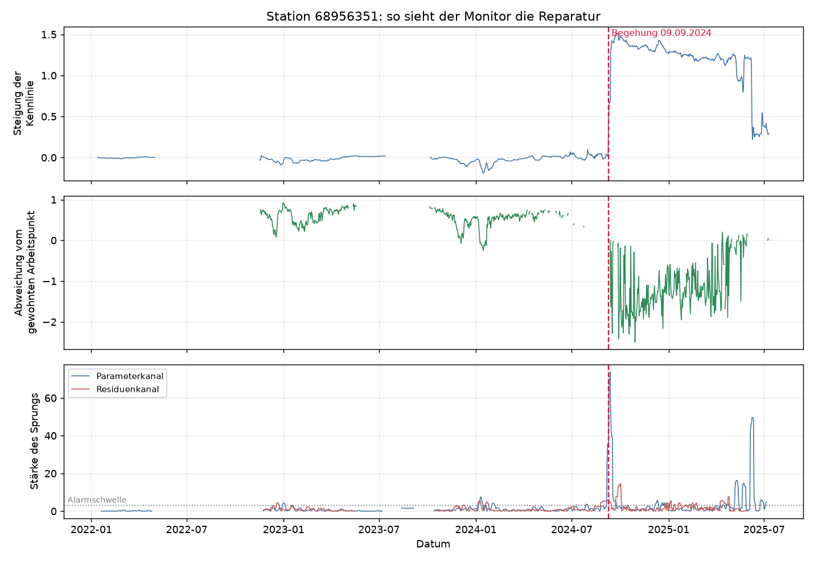
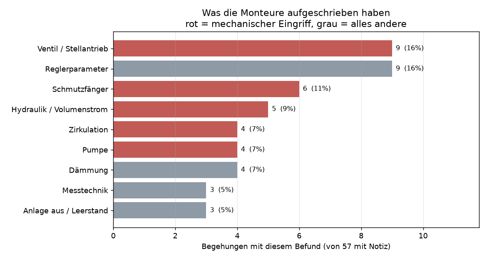
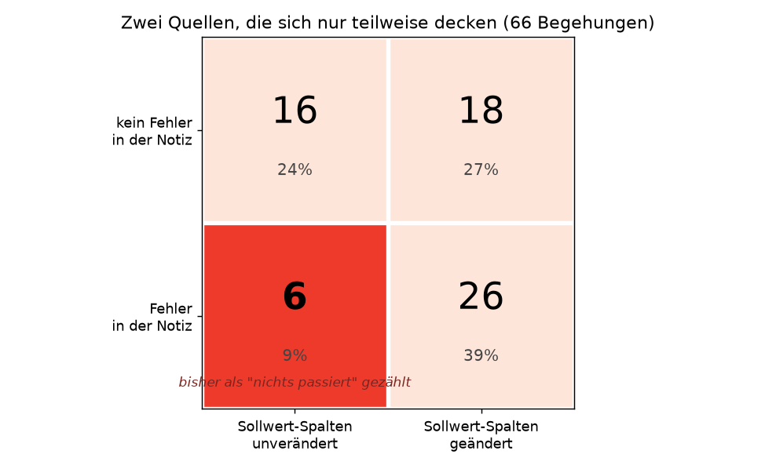
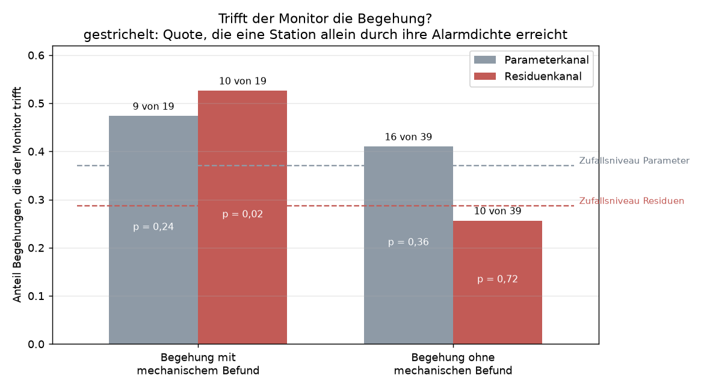

# Ergebnisse der Notebooks 12 bis 15

Stand 09.10.2026. Vier Schritte, die aufeinander aufbauen:

| Notebook | Frage | Ergebnis | Nutzbar? |
|---|---|---|---|
| 12 Ternär | Lässt sich die ÜZ-Folie nachbauen? | ja, aber die Folienaussage hat das falsche Vorzeichen | als Werkzeug nein, als Befund ja |
| 13 Stationsbilder | Gibt es bessere Darstellungen? | Kennlinie und Carpet sind deutlich besser lesbar | ja, für Menschen |
| 14 Monitor | Lässt sich das automatisieren? | Prinzip funktioniert, am bekannten Fall sehr klar, über alle Stationen nicht signifikant | Prototyp |
| 15 Befunde | Liegt es an den Labels? | ja; mit besseren Labels trennt der Monitor | ja |

**Testfall für alles ist Zähler 68956351:** Dort stand ein Ventil drei Jahre offen und wurde im September 2024 repariert. Das ist der einzige Fall, bei dem wir aus den Messdaten sicher wissen, was passiert ist.

## 1 Ternärdiagramme (Notebook 12)

**Idee:** Eine Station kann ihre Leistung über mehr Wasser (Volumenstrom) oder über mehr Wärmeentzug (Spreizung) anpassen. Das Dreieck zeigt, welcher Weg gerade benutzt wird.

- sechs Dreiecke für dieselbe Station: oben vor / während / nach der Begehung, unten die drei Jahreszeiten
- jeder Punkt ist eine Betriebsstunde, Farbe = Effizienz (gelb gut, blau schlecht)
- vorher Median 3,4 kWh/m³, nachher 36,4, also Faktor zehn

- jeder Punkt eine Station im Winter: waagerecht der Anteil Spreizungsregelung, senkrecht die Effizienz
- je mehr Spreizungsregelung, desto schlechter (Rangkorrelation −0,48)
- Auf der ÜZ-Folie ist die Spreizungsecke die gute Ecke. Bei uns ist es umgekehrt.
- Erklärung: Eine Station mit festsitzendem Ventil kann gar nicht über den Volumenstrom regeln und landet deshalb automatisch dort.

**Funktioniert:**

- Die Rechnung stimmt, die Kontrollsumme liegt über alle 776 Panels zwischen 0,971 und 1,096.
- Das Teilnetz ist überwiegend durchflussgeregelt: 74 von 94 Stationen im Winter, nur 12 spreizungsdominiert.

**Funktioniert nicht:**

- Stationstypen clustern: drei Gruppen trennen die Effizienz um Faktor 3,7, aber die Silhouette liegt nur bei 0,311. Eher ein Gefälle als echte Typen.
- Die Regelungsart ändert sich durch die Begehung nicht (41 Stationen, p = 0,51).

**Fazit:** guter Befund zum Vorzeichen, aber zur Fehlererkennung taugt das Dreieck nicht. Es normiert die Leistung weg.

## 2 Kennlinie, Carpet-Plot, Dauerlinie (Notebook 13)

### Kennlinie

- waagerecht Leistung, senkrecht Volumenstrom, beides logarithmisch. Farbe = Rücklauftemperatur.
- **vor der Begehung:** flache rote Wolke. Egal wie viel Leistung, es fließen immer 500 bis 1000 l/h, Rücklauf über 70 °C. So sieht ein offenes Ventil aus.
- **nach der Begehung:** saubere Gerade mit Steigung 1,28, Rücklauf blau
- Die Steigung ist rechnerisch derselbe Wert wie der Durchflussanteil aus dem Dreieck. Zusätzlich sieht man, ob die Punkte überhaupt auf einer Linie liegen (R² im Median 0,012 bei flacher, 0,789 bei steiler Steigung).

### Carpet-Plot

- waagerecht die Kalenderzeit, senkrecht die Tagesstunde. Oben Rücklauf, unten Volumenstrom.
- Ende 2022 bis September 2024: durchgehend rot, Tag und Nacht, Sommer wie Winter
- danach blau mit Tagesstruktur (Nachtabsenkung, Warmwasserspitze morgens)
- Nebenbefund: bis Ende 2022 lieferte die Station nur einen Wert pro Tag statt 24

### Dauerlinie

- alle Stundenwerte nach Größe sortiert: in wie viel Prozent der Zeit wird ein Wert überschritten
- vorher liegt der Rücklauf fast durchgehend über 50 °C, nachher nur noch in ca. 40 % der Zeit
- einzige der drei Darstellungen mit einem Begehungseffekt über alle Stationen: Der Anteil der Stunden über 50 °C sinkt (44 Stationen, p = 0,048). Die Kennliniensteigung zeigt nichts (p = 0,50).

**Funktioniert:** Die Darstellungen messen verschiedene Dinge. Die zehn auffälligsten Stationen nach Kennlinienstreuung und nach warmem Rücklauf überschneiden sich gar nicht.

**Achtung:** Die Performance in kWh/m³ ist auf Stundenebene dasselbe wie die Spreizung (Performance = 1,163 × ΔT). Korrelationen gegen die Performance beweisen deshalb wenig. Unabhängig sind nur Prüfungen gegen die Begehungen.

**Fazit:** gute Diagnosebilder, aber 100 Stationen von Hand anschauen ist keine Automatisierung.

## 3 Kennlinienmonitor (Notebook 14)

**Idee:** Bisher wurden Stationen untereinander verglichen. Das scheitert, weil ein Altbau mit Heizkörpern und ein Neubau mit Fußbodenheizung ganz verschieden aussehen, ohne dass etwas kaputt ist. Der Monitor vergleicht jede Station nur mit sich selbst: Hat sich die Kennlinie gegenüber den Wochen davor plötzlich verschoben? Das braucht keine Labels.

- **oben:** Steigung der Kennlinie. Zwei Jahre flach bei null (offenes Ventil), am Begehungstermin Sprung auf 1,4.
- **Mitte:** Abweichung vom gewohnten Arbeitspunkt. Vorher konstant bei ca. +0,8, danach im Minus.
- **unten:** Alarmkanal. Der Ausschlag am 12.09.2024 erreicht 74, der größte Wert der ganzen Historie, drei Tage nach der Begehung.

Der Monitor findet den bekannten Fall, ohne zu wissen, wonach er sucht.

Der erste Entwurf fand ihn nicht: Im Juli und August 2024 läuft die Station nur rund 60 Stunden im Monat, ein starres 14-Tage-Fenster hat dann zu wenige Punkte. Das Fenster dehnt sich jetzt bis auf 60 Tage.

**Funktioniert:** Das Prinzip, und der bekannte Fall sehr deutlich.

**Funktioniert nicht:**

- Über alle 100 Stationen nur ca. 30 % über Zufall, nicht signifikant (p = 0,085 und 0,099)
- 16 Einstellungen probiert, keine wird belastbar signifikant
- Der stärkste Alarm je Station trifft die Begehungen schlechter als Zufall.
- Die Gruppe ohne dokumentierten Eingriff schneidet besser ab als die mit. Das war der Anlass für Notebook 15.

## 4 Begehungsnotizen als Labels (Notebook 15)

**Bisherige Labels:** die Alt-Neu-Spalten der Begehungstabelle (Heizzeit, Rücklaufsollwert). Daneben gibt es eine Freitextspalte des Monteurs, vorhanden bei 57 von 66 Begehungen und bisher ungenutzt. Bei 68956351 steht der Stellmotortausch nur dort.

**Vorgehen:** Die 57 Notizen werden regelbasiert in neun Fehlerkategorien kodiert, abgesichert mit 37 Tests. Knifflig sind Verneinungen: „Schmutzfänger stark voll" ist ein Fehler, „fast leer" nicht.

- Häufigkeit der Fehlerarten in den 57 Notizen, rot = mechanische Eingriffe
- Das ist die Häufigkeit in den Notizen, nicht im Netz.

- 6 Begehungen nennen im Text einen Fehler, ohne dass sich ein Sollwert geändert hat. Die galten bisher als „nichts passiert".
- 18 Fälle mit Sollwertänderung, aber ohne Befund im Text
- Keine der beiden Quellen ist vollständig.

**Gegenprobe:** Der Monitor sieht nur hydraulische Änderungen. Ein getauschtes Ventil ändert die Kennlinie, eine verschobene Heizzeit nicht. Bei mechanischen Eingriffen müsste er also besser treffen.

- links Begehungen mit mechanischem Befund, rechts alle anderen. Die gestrichelte Linie ist die Zufallsbasis.
- mechanisch: 10 von 19 Treffer statt erwarteter 5,5 (p = 0,024)
- alle anderen: Zufallsniveau

Das ist die erste Prüfung gegen die Ground Truth, die über den Zufall hinauskommt.

**Einschränkungen:**

- 19 Termine sind wenig, ein Fall verschiebt die Quote um 5 Prozentpunkte.
- Die Teilung wurde erst nach dem Nullergebnis gewählt. Sauber wäre: Regel vorher festlegen und an neuen Begehungen prüfen.
- p-Werte sind einseitig. Zweiseitig 0,038 und 0,076.
- 58 Termine auf 51 Stationen, also nicht alle unabhängig.

## Was wir jetzt haben

- einen Prototyp, der ohne Labels läuft und die einzige bekannte Reparatur am stärksten anzeigt
- zum ersten Mal ein Validierungsergebnis über dem Zufall
- Klarheit, welcher Kanal nützlich ist: der Residuenkanal, der Parameterkanal trennt nicht
- einen Beleg statt einer Vermutung, dass die bisherigen Labels unvollständig waren

## Was noch fehlt

- **Entscheidungsbaum:** Die größte Fehlerkategorie hat 9 Fälle, das reicht nicht für Training und Test.
- **Kausalität:** Dafür bräuchte es eine Kontrollgruppe nicht begangener Stationen.
- **Zählertausch:** Ein Teil der großen Ausschläge könnte ein gewechselter Zähler sein. Ein Tauschdatum gibt es nirgends.

## Offene Fragen ans Team

- Passen die neun Fehlerkategorien fachlich? Bleiben Zirkulation und Pumpe getrennt?
- Kann die ÜZ Zählertauschdaten mit Datum liefern?
- Drei Notizen lassen sich nicht einordnen (ein Defekt ohne klare Zuordnung, zwei Messwerte ohne Bewertung). Befund oder Normalwert?
- Monitor weiterverfolgen oder zurück zum Clustering? Der Monitor ist bisher der einzige Ansatz, der etwas getroffen hat.
